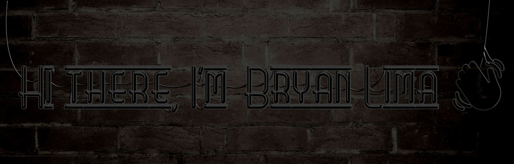

<h1 align="center"> 
	
</h1>

<!-- <h1 align="center"> 
	Hi there, I'm Bryan Lima 👋
</h1> -->

<h5 align="center"> 
	<i>"As pessoas que evitam os fracassos, também evitam os sucessos."</i>
</h5>

<!-- 

 -->

  

  
  
  

  <!--  -->

  <!--  -->

  <!--  -->

  <!--  -->

  <!--  -->
  
  <!--  -->

  

<!-- 
 -->

  

  

## 🎓 Formação

- **Graduação:** Análise e Desenvolvimento de Sistemas
- **Período:** Jan/2018 – Jul/2020
- **Instituição:** Faculdade Bilac - São José dos Campos/SP
- **Projetos desenvolvidos:**
  - **Título:** Tattooando 💀
  - **Sobre:** Projeto de desenvolvimento de aplicação web e mobile para agendamento de serviços de tatuagem, consumindo webservice própria.
  - **Link para repositório:** ⚠️ Repositório privado
  - **Link para webservice:** **[webservice-tattooando.000webhostapp.com](https://webservice-tattooando.000webhostapp.com/)**
  ---
  - **Título:** AgendaPet 🐶
  - **Sobre:** Projeto funcional de aplicativo para Android de agendamento de PetShop. Desenvolvimento usando linguagem Java, Firebase e banco de dados NoSQL. Projeto apresentado na Semana de Gestão, Tecnologia e Inovação (SGTI), promovido pela Faculdade Bilac.
  - **Link para repositório:** **[@BilacSJC/AgendaPet](https://github.com/BilacSJC/AgendaPet)**
  ---
  - **Título:** Memory Game 🎴
  - **Sobre:** Atividade acadêmica para exercitar conceitos da disciplina Design de Games. Desenvolvimento de jogos da memória utilizando apenas HTML, CSS e Javascript
  - **Link para repositório:** **[@bryan-lima/memory-game](https://github.com/bryan-lima/memory-game)**
  - **Link para jogar online:** **[Acessar Home](https://bryan-lima.github.io/memory-game/index.html)**
  ---
  - **Título:** Mini Quiz (Aplicativo para Android) 📱
  - **Sobre:** Aplicativo desenvolvido para a disciplina de Programação para Dispositivos Móveis, e consiste num simples quiz de tema livre. O intuito desta atividade é explorar a programação para Android, utilizando linguagem Java
  - **Link para repositório:** **[@bryan-lima/appAndroid-Mini-Quiz](https://github.com/bryan-lima/appAndroid-Mini-Quiz)**
---

- **Graduação:** Técnico em Redes de Computadores
- **Período:** Jan/2016 – Jul/2017
- **Instituição:** ETEC Cônego José Bento - Jacareí/SP
- **Trabalho Conclusão de Curso:**
  - **Título:** Sistema de Automação Residencial Integrado à Rede 🏠
  - **Sobre:** Projeto funcional de uma automação residencial usando Arduino Uno, e uma maquete de residência. O sistema instalado na maquete, é controlada via aplicativo Android. O aplicativo é capaz de aceder e apagar luzes, abrir e fechar o portão.
  - **Veja o projeto em funcionamento:** ****
  - **Link para repositório:** **[@augustoliks/Casa-Inteligente-Arduino](https://github.com/augustoliks/Casa-Inteligente-Arduino)**
<!-- ---

- **Graduação:** Técnico em Administração de Empresas
- **Período:** Jan/2013 – Jul/2014
- **Instituição:** ETEC Cônego José Bento - Jacareí/SP
- **Trabalho Conclusão de Curso:**
  - **Título:** A.
  - **Sobre:** A.
  - **Link para site:** A. -->
---

## 🧠 Qualidades

- Autodidata
- Responsável
- Focado

<!-- ## ❔ Interesses

- Javascript
- React
- Python -->

---

_**Última revisão:** 17 nov. 2020._